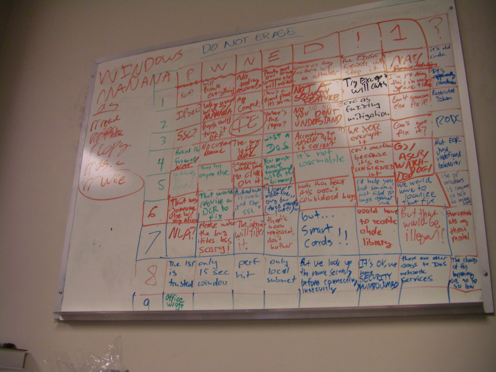

# History: Windows Vista Bingo Whiteboard
Intention: Preserve a piece of software history  

The image below shows a bingo table with excuses, code auditors anticipated to hear, while they audited Windows Vista.  
Since the hand writing isn't readable on some spots, I transcripted it to a readable format.  

**Original Image**
  
> Image- and story source: https://blog.fefe.de/?ts=a81a5919  

> *Legend:* 
> `(?)`  -> *unsure about the reading*  
> `(ur)` -> *unreadable*  
> `(or)` -> *alternative interpretation (unsure)*  
> `(c:)` -> *comment*  
> `*`    -> *single character not readable (unsure)*  

**Transcript**  
(Text outside the table)  
L1: "WINDOWS" "DO NOT ERASE"  
L2: "MANANA"  
L3: "an" (or) "as"  
L4: "//re\*" (?)  
L5: "//if\*te" (?)  
L6: "//copy"  
L7: "//ds.\*" (?)  
L8: "//wi\*e" (?)(c: word is highlighted by a circle)  

(Text inside the table)  

|   | P                                   | W                                            | N                                                    | E                                                 | D                                                                      | !                                                            | 1                                                 | ?                                                   |
|---|-------------------------------------|----------------------------------------------|------------------------------------------------------|---------------------------------------------------|------------------------------------------------------------------------|--------------------------------------------------------------|---------------------------------------------------|-----------------------------------------------------|
| 1 | "Kerb?"                             | "will Breake everything"                     | "No testing resources" (?)                           | "That's not our team, someone else will \*"    | "Secure as long as there isn't an attacker"                         | "the EDGE firewall will stop it"                          | "NA\* Domain Isolation"                           | "it's old code"                                     |
| 2 | "IPsec?"                            | "\* \* \* \* MANANA"                         | "App Compat."                                        | "There's a \* proof it's secure"               | "NOT A SECURITY FEATURE"                                               | "Try Except will catch"                                      | "I'm just doing this in my spare time" (?)        | "It's appearing random" (?)                         |
| 3 | "SSC?"                              | "People will turn it off"                    | "IE"                                                 | "Where's the repro?"                              | "NO NO NO YOU DONT UNDERSTAND"                                      | "crc as fuzzing mitigation"                                  | "Can't someone else fix it?"                      | "Restricted Token"                                  |
| 4 | "Behind the firewall/NAT"           | "No customer demand" (?)                     | "The guy left/died"                                  | "JUST A DoS" (?)                                  | "According to MSDN this is correct"                                    | "We XOR encrypt it"                                          | "Can't you fix it?"                               | "RODC"                                              |
| 5 | "The binary is signed" (?)          | "Don'T tell anyone else"                     | "Someone would love to click on it"                  | "You must have tampered with the binary" (?)      | "it's not wasmable" (?)                                                | "can't overflow because it's an UNSIGNED int"                | "G\*/AS\*R/WATCH-DOG/DEP"                         | "Not EOP - Just undefined behavior" (?)             |
| 6 | "That was someone else w/ my alias" | "That would require a DCR to fix" (?)        | '"Authentication is overkill, just like SSL"' (?) | '"Doesn't meet the bu\* \*" (three months later)' | "back then read AVS weren't considered bugs" (?)                       | "I'd help you, but someone just filed 20 bugs against me" | "We would have to localize that fix"              | "use of windows is consent to talk to microsoft" |
| 7 | "NLA?"                              | "please make the bug titles less scary!" (?) | "The i\* will filter it"                             | "that's been reviewed, don't bother"              | "but... Smart Cards!!"                                                 | "would have to \*te whole library"                           | "But that would be illegal!"                      | "Sharepoint ate my threat model"                    |
| 8 | "The ISP is trusted"                | "only 15 sec window"                         | "perf hit"                                           | "only local subnet"                               | "But we look up the name securely before connecting insecurely" (?) | "It's ok, we have SECURITY MUMBOJUMBO"                    | "there are other ways to DoS network services" | "The chances of this happening are so so so low" |
| 9 | "office \* \*"                      | <empty>                                      | <empty>                                              | <empty>                                           | <empty>                                                                | <empty>                                                      | <empty>                                           | <empty>                                             |

